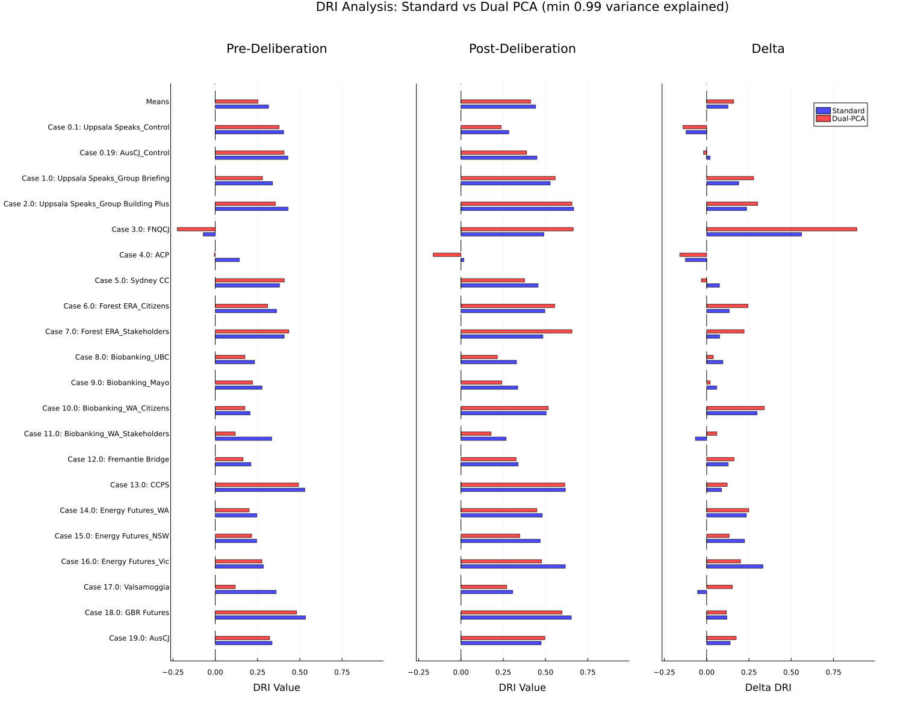
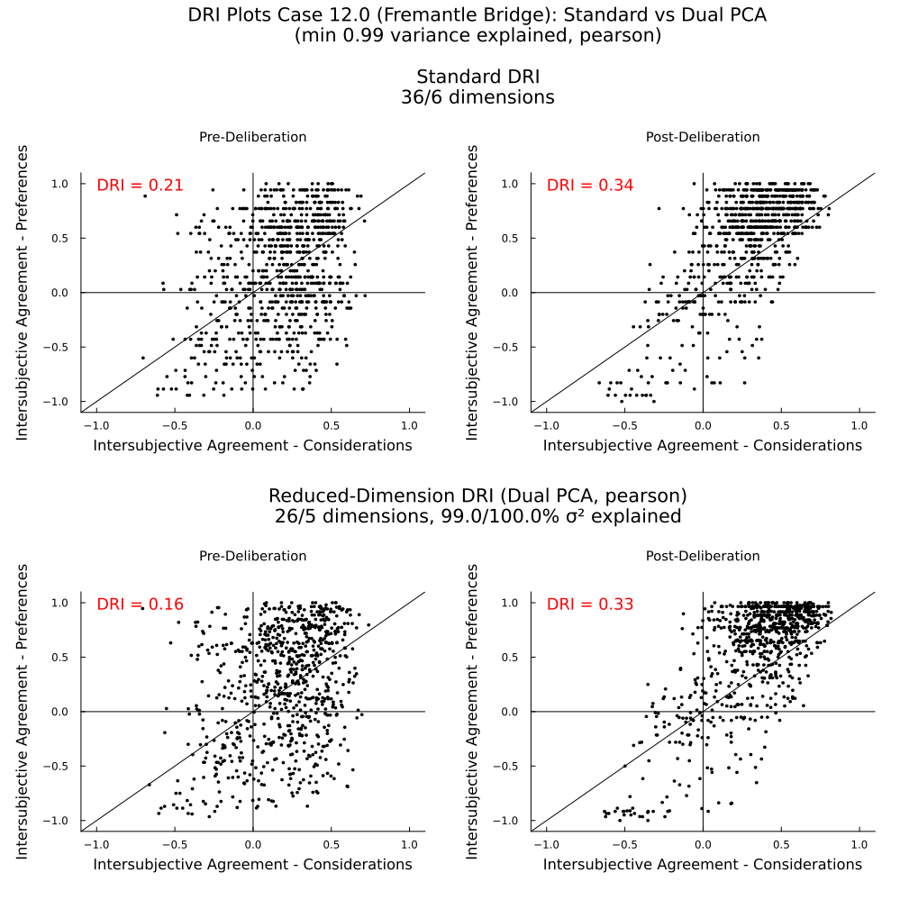
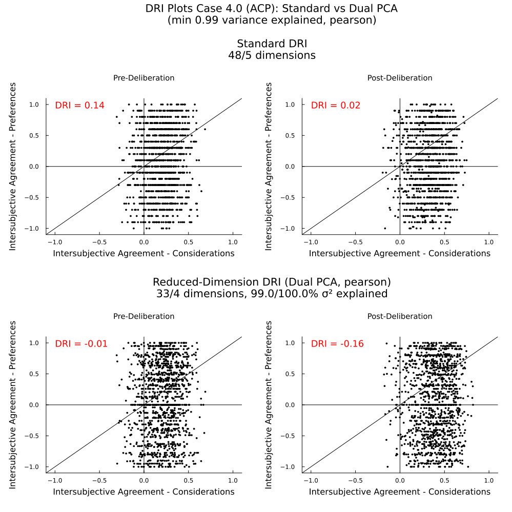

# Dual-PCA DRI

In this experiment, do a DRI analysis on reduced-dimension data using PCA.

## Motivation

One motivation for this is the observation that DRI results can be skewed by inclusion or exclusion of controversial statements, as demonstrated by the [statement-subset.md] experiment. If survey designers or Polis participants add a large number of non-controversial statements, intersubjective correlations can be arbitrarily increased, shifting points on the IC plot rightwards or upwards. Adding a lot of controversial but highly-correlated statements will tend to spread values outward, while adding many uncorrelated controversial statements will tend to concentrate values around zero.

PCA partly solves this problem by minimizing redundancy, potentially reducing multiple redundant or highly correlated statements into a single factor. The resulting factors may be a better representation of the **fundamental** dimensions of agreement/disagreement in user opinion.

## Method

The standard DRI calculation starts with two rank matrices: one for consideration statements, and one for preference statements. For each matrix, columns are users, rows are statements, and cells are users **ranking** of each item. There are no empty cells.

PCA is performed on the user-standardized data to derive principal component scores for each user. This transforms the original statements × users matrix into a components × users matrix, reducing the number of rows from the number of statements to the number of principal components. This is followed by a Varimax rotation. This is similar to the standard procedure used in Q Methodology (as I understand it). However, for this experiment we haven't made an attempt to interpret the principal components.

PCA was performed separately on consideration and preference matrices.

Intersubjective correlations and DRI calculations are then performed using the same methodology in the [reference-implementation](./reference-implementation.md) and in the original paper on the reduced-dimension matrices.

Note that intersubjective correlations are calculated using Pearson correlations for each pair of individuals (columns) in the reduced-dimension matrices. The original methodology uses a Spearman correlation, but this is in fact a Pearson correlation of the columns of the original matrices (since the original matrices are rankings). So this methodology is the same except for the dimension reduction before the Pearson correlations are calculated.

A minimum of 2 components will be selected for both matrices. The maximum number of components selected is determined by the `minimum_variance_explained` parameter, which defaults to .99.

## Results

Here are overall results.

On average reducing dimensions decreases DRI values but increases deltas (because DRI values decreased *more* for pre-deliberation data). 

Below is a more detailed analyses for two cases.

## Example 1: Fremantel Bridge

The first row of charts in the figure below are the standard pre-post IC charts for this case. The second row are the pre-post IC charts for the dual-PCA DRI calculation with the number of consideration dimensions reduced from 36 to 26 and preference dimensions reduced from 6 to 5.

After dimension reduction, points on the IC plot begin to spread out horizontally, indicating pairs of individuals have stronger correlations (positive or negative) on the consideration components.

Note also that while pre-deliberation DRI decreases, post-deliberation DRI increases. This seems to be mostly due to a large cluster in the top right quadrant. Before dimension reduction, this cluster sits just to the left/above the diagonal, indicating a high level of intersubjective agreement on preferences that isn't quite matched by an equally high level of intersubjective agreement on considerations. But in the lower-dimensional space, IC points spread out horizontally, moving this cluster to the right towards the diagonal and increasing DRI.

Further reducing dimensions continues the trend of reducing pre-deliberation DRI and increasing post-deliberation DRI. 

## Example 2: ACP

A somewhat different story is told with ACP. Here is a chart showing the result of reducing from 48 considerations and 5 preferences to 33 considerations and 4 preferences: 

As in the previous example, points in the IC chart are spread out more horizontally. 

Again, further reducing dimensions continues this trend. Also in the post-deliberation chart, there is a clear shift to the right. 

This reveals an increasing level of **agreement** on considerations post-deliberation.

However, this agreement doesn't correlate with agreement on preferences. The result is a very negative DRI both pre- and post-deliberation. However this analysis shows an overall increase in DRI post-deliberation, where the original DRI shows a decrease.
