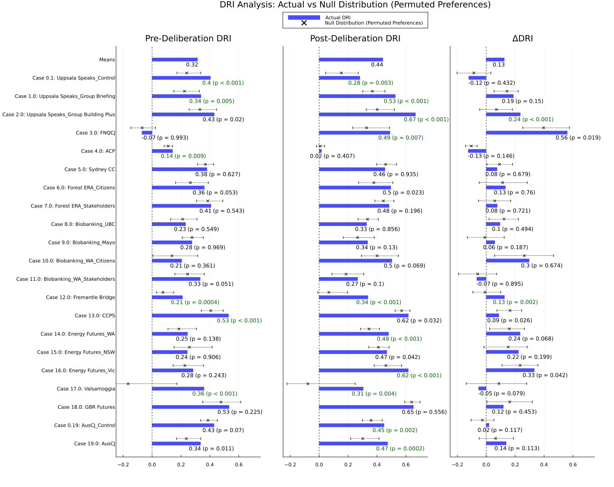

## 1. Purpose & Scope

The **Deliberative Reason Index (DRI)**, as proposed by [Niemeyer, Veri, Dryzek, and Bächtiger (2023)](https://doi.org/10.1017/S0003055423000023) measures the **intersubjective consistency** (ISC) of a group -- the extent to which individuals' agreement on preferences (like policies) correlates with their agreement on underlying considerations (like beliefs and values). High intersubjective consistency indicates that a group has arrived at a shared logic linking considerations to preferences. The authors use DRI to estimate intersubjective consistency for 19 deliberative forums and to estimate the effect of deliberation on ISC under various conditions.

In this experiment, we use resampling to estimate the distribution of DRI values for each case under the null hypothesis that considerations and preferences are statistically independent (implying absence of ISC). We find that the mean of this distribution is positive for most cases -- high DRI values are expected even when there is no correlation between considerations and preferences. However, for many cases, DRI values fall outside the range expected under the null hypothesis.

----

## 2. Brief Summary of Method: Calculating DRI

We calculate DRI using the method described in the supplementary materials to the paper:

1. **Survey data**: Each individual provides (a) an ordinal ranking of ~20–40 consideration statements and (b) a ranking of ≤10 policy options.
2. **Intersubjective Agreement (ISA)**: For every pair (i, j), compute **intersubjective agreement (ISA)** using Spearman’s ρ for their consideration-rankings (ρC) and for their preference-rankings (ρP)
3. **Consistency distance**: Plot (ρC, ρP) on an x–y scatter; measure each point’s orthogonal distance to the 45° line (y = x). Small distances indicate high deliberative consistency.
4. **Aggregate**: Average these distances for each individual (yielding DRIInd scaled to [–1, +1]) and then across the group to obtain a single **group DRI**.

## 3. Experiment

DRI is designed to measure intersubjective-consistency, a group-level feature where "the extent to which deliberators disagree is constrained by a shared 'logic,' such that their diverging values or beliefs should yield a comparable degree of divergence in expressed preferences.” (Niemeyer et al., 2023, p. 4). Thus intersubjective-consistency should manifest as a correlation between considerations-ISA and preferences-ISA. DRI is designed to measure this correlation in a way that overcomes the problem of domain restriction [todo: reference C.1 in supplementary matrials). It follows that the absence of any correlation (e.g. statistical independence) implies absence of ISC.

We estimate the distribution of DRI values under the null hypothesis using a permutation test in which individuals preferences are randomly shuffled.  This shuffling renders considerations-rankings and preference-rankings statistically independent while preserving the overall distribution of ISA values.

We then calculate DRI using the standard methodology. Repeating this process 10,000 gives us an estimate of the null distribution of DRI values. We then calculate a 99% confidence interval for each case, and compare it to the actual DRI or DRI delta to obtain a two-sided p-value.

## 4. Results

The results are summarized in the figure below. For each case and each stage (pre-, post-, and delta), the mean and 99% [confidence interval] of the null distribution are shown in black, and actual DRI values are shown in blue. Cases where actual DRI or delta falls outside the 99% [confidence interval] are shown in green.

