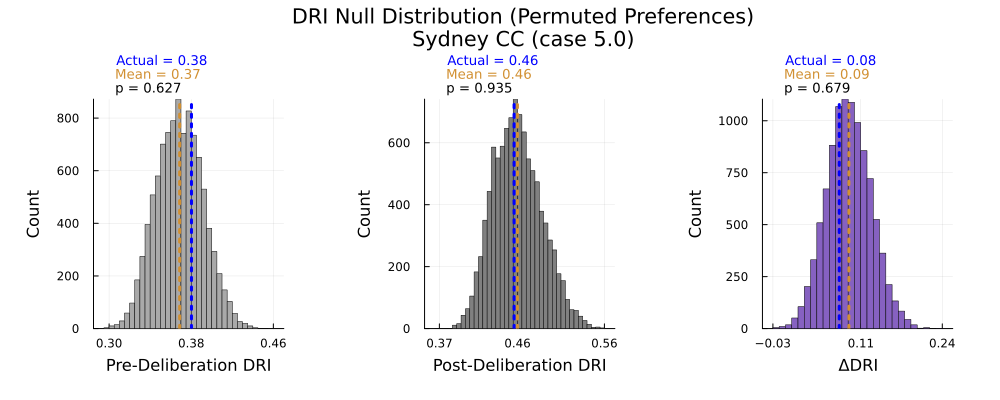
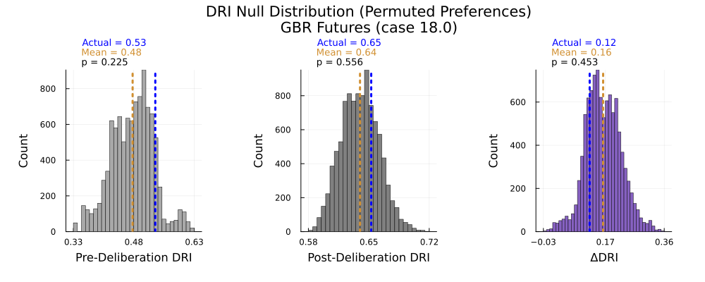
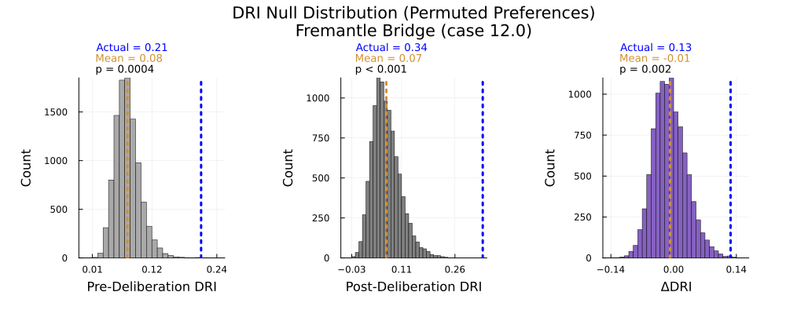
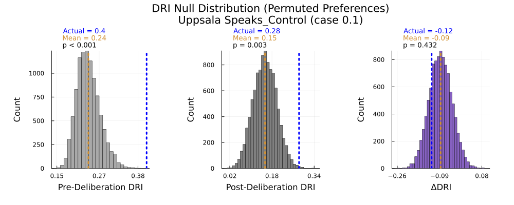
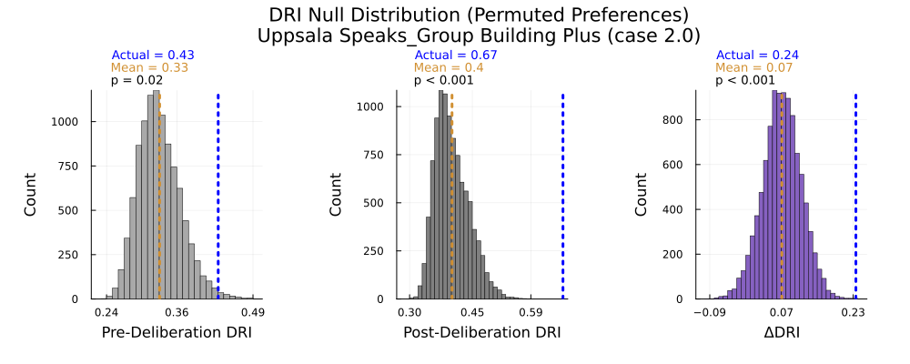

## 1. Purpose & Scope

The **Deliberative Reason Index (DRI)**, as proposed by [Niemeyer, Veri, Dryzek, and Bächtiger (2023)](https://doi.org/10.1017/S0003055423000023) measures the **intersubjective consistency** (ISC) of a group -- the extent to which individuals' agreement on preferences (like policies) correlates with their agreement on underlying considerations (like beliefs and values). High intersubjective consistency indicates that a group has arrived at a shared logic linking considerations to preferences. The authors use DRI to estimate intersubjective consistency for 19 deliberative forums and to estimate the effect of deliberation on ISC under various conditions.

In this experiment, we use resampling to estimate the distribution of DRI values for each case under the null hypothesis that considerations and preferences are statistically independent (implying absence of ISC). We find that the mean of this distribution is positive for most cases -- high DRI values are expected even when there is no correlation between considerations and preferences. However, for many cases, DRI values fall outside the range expected under the null hypothesis.

----

## 2. Brief Summary of Method: Calculating DRI

We calculate DRI using the method described in the supplementary materials to the paper:

1. **Survey data**: Each participant provides (1) an ordinal ranking of ~20–40 consideration statements, and (2) a ranking of ≤10 preference statements.
2. **Intersubjective Agreement (ISA)**: For each pair of participants (i, j), compute **ISA** using Spearman’s ρ for their consideration-rankings (ρC) and for their preference-rankings (ρP).
3. **Distance to Diagonal**: For each pair, plot (ρC, ρP) on an x–y scatter; measure each point’s orthogonal distance to the 45° line (y = x); small distances indicate high ISC.
4. **Aggregate**: Average these distances for each individual (yielding DRIInd scaled to [–1, +1]) and then across the group to obtain a single **group DRI**.

## 3. Experiment

DRI is designed to measure intersubjective-consistency (ISC), a group-level feature which, when maximized, means that "the extent to which deliberators disagree is constrained by a shared 'logic,' such that their diverging values or beliefs should yield a comparable degree of divergence in expressed preferences.” (Niemeyer et al., 2023, p. 4). Thus, ISC should manifest as a correlation between considerations-ISA and preferences-ISA. DRI is designed to measure this correlation in a way that overcomes the problem of domain restriction. It follows that the absence of any correlation (e.g. statistical independence) between considerations and preferences would imply the absence of ISC.

We estimate the distribution of DRI values under the null hypothesis using a permutation test in which individuals preferences are randomly shuffled. This shuffling renders considerations-rankings and preference-rankings statistically independent while preserving the overall distribution of ISA values. We then calculate DRI using the standard methodology.

Repeating this permutation process 10,000 times gives us an estimate of the null distribution of DRI values. We then calculate a 99% null interval for each case, and compare it to the actual DRI or DRI delta to obtain a two-sided p-value.

## 4. Results

### 4.1 Overall Results

The results are summarized in the figure below. For each case and each stage (pre-, post-, and delta), the mean and 99% null interval of the null distribution are shown in black, and actual DRI values are shown in blue. Cases where actual DRI or delta falls outside the 99% null interval are shown in green.

### 4.2 Case-Level Results

Histograms of the null distributions for a few sample cases are shown below. Each plot below shows the null distribution for the pre-deliberation, post-deliberation, and delta DRIs for one case. Plots for all cases can be found [in this directory](../published-output/permuted-preferences/).

#### 4.2.1 Sample Cases: High Mean, High p-value

For the two sample cases below, the mean of the null distribution is high, and the actual DRI falls well within the 99% null interval. This suggests that positive DRI values in these cases do not indicate ISC.

#### 4.2.2 Sample Cases: High Mean, Low p-value

For the two sample cases below, the mean of the null distribution is high. However, actual post-deliberation DRI and DRI deltas fall *outside* (or nearly outside) the 99% null interval. This suggests that deliberation increased ISC in these cases.

#### 4.2.3 Sample Cases: Uppsala Speaks

Finally, it is interesting to compare the three Uppsala Speaks cases. In all three cases (including the control), both pre-deliberation and post-deliberation DRI are outside or nearly outside the 99% null interval. For the two treatment cases, ΔDRI is positive. However, only for the "Group Building Plus" case does the *delta* fall outside the null interval.

