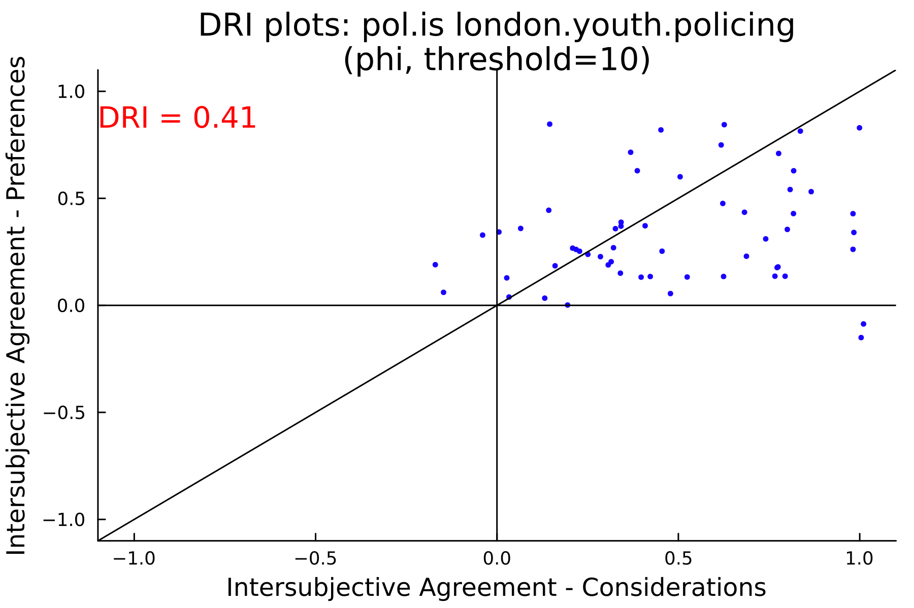

# Proof of Concept DRI for pol.is

Here we use pol.is data as the input. Because user votes in pol.is are binary agree/disagree (or pass) values, we use different methods for calculating the correlation between two users values. By default, we use the Phi coefficient, but Pearson's or other correlation coefficients can be plugged in. 

**NOTE**: statements are classified RANDOMLY as considerations/preferences.

## Output Charts

Below are sample outputs for two pol.is cases:

### vtaiwan.uberx Case

- **Correlation (Phi):**  
  

### london.youth.policing Case

- **Correlation (Phi):**  
  