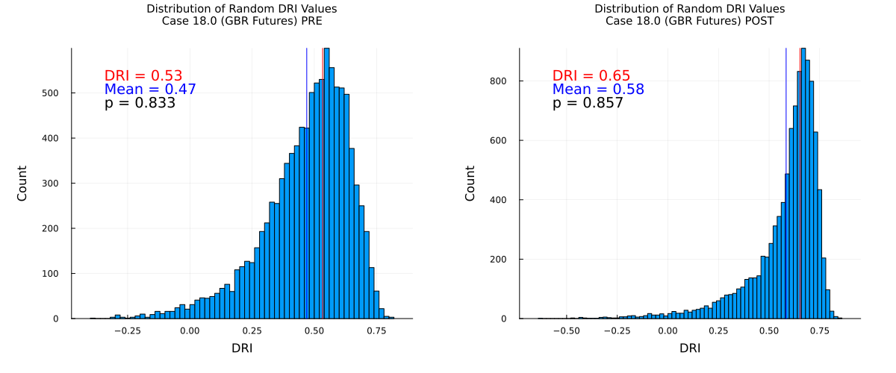
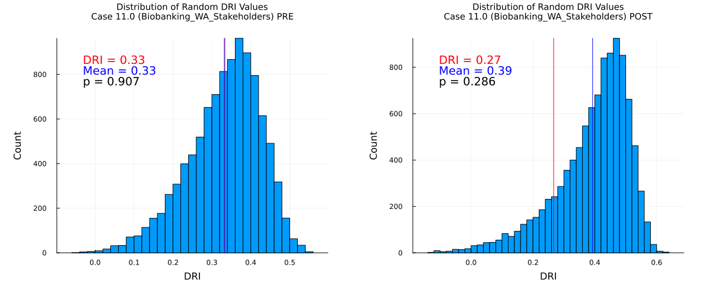

# Random-Tagging Analysis

The [Polis proof-of-concept](polis-poc.md) shows us that that even designating statements as considerations or preferences *randomly* results in a positive DRI. This is because, generally, the intersubjective-agreement (pairwise Spearman correlation) on a random group of statements will correlate with intersubjective agreement on another random group of statements.

This naturally raises the question of whether inter-subjective agreement on considerations correlates with inter-subjective agreement on preferences to a *greater degree* than it does to a random set of statements.

A simple way to test this hypothesis is to ignore the way the statements are tagged in the dataset, and instead tag them randomly, and see if we get a similar result. If we repeat this process many times times, we can count the number of times the resulting DRI is higher than the actual DRI. This gives us an estimate of the probability that the actual DRI would be as high as it is if tags were random.

random-tagging.jl tests this hypothesis using the data from all the cases in the paper. It randomly tags the statements and calculates the DRI, repeating this process n times for each case, then produced a histogram and a p-value: which is the probability that random tagging would result in a DRI as extreme.

### Results

- Number of datasets: 42
- Fisher's statistic: 90.90986159098617
- Aggregate p-value (method1) using Fisher's method: 0.28424599933378114

p-values for all cases are in [this CSV file](../published-output/random-tagging/random-tagging_results_method1.csv)

Charts for all cases are [here](../published-output/random-tagging)

Below are some sample output charts:

### Alternative Methodology

One subtle problem with this methodology: the dataset contains users *ranks* of each consideration/preferences. If we change the set of items counted as a consideration or preference, the rankings lose their meaning.

To account for this, we implemented a slightly modified methodology. First, calculate the DRI based on a *random subset of considerations* against *all preferences*. This should give us a value that *approximates* the actual DRI (I have confirmed that the average of this value over many samples is approximately equal to the actual DRI). This way, we are no longer calculating Spearman correlations based on a mixed set of considerations/preferences.

Next, we calculate a hypothetical DRI using the same subset of considerations against all other considerations.

Repeat this n times and calculate the number of times the resampled DRI is greater than the control DRI to obtain a p-value.

p-values for all cases are in [this CSV file](../published-output/random-tagging/random-tagging_results_method2.csv)

### Results

- Number of datasets: 42
- Fisher's statistic: 133.76768923929313
- Aggregate p-value (method2) using Fisher's method: 0.0004535416185228458

