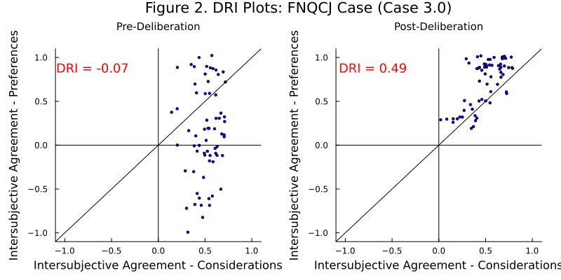
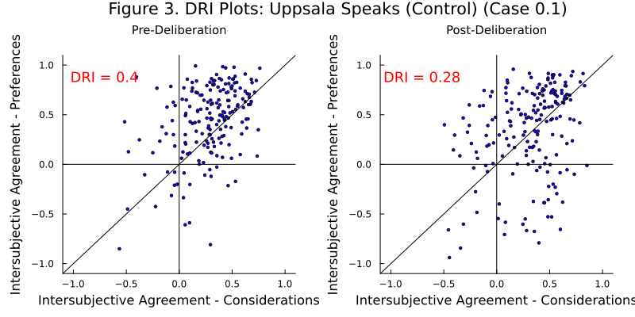
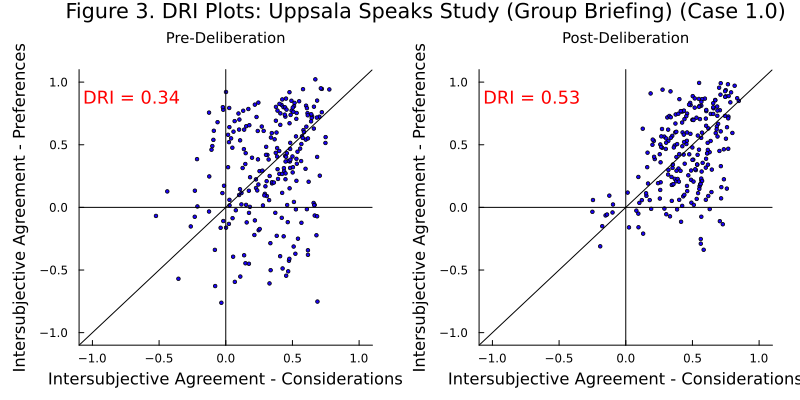
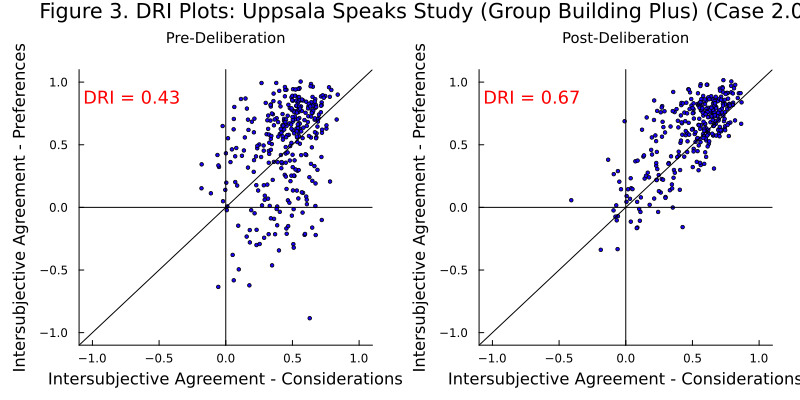

# DRI Reference Implementation

The DRI reference implementation re-produces the DRI calculations and charts from the research paper using Julia. The DRI calculations are identical. Chart styles are different, and exact data point positions in the charts differ slightly because of random jitter (added in reference implementation). 
## Output

And CSV files are [here](../published-output/reference-implementation)

**Charts:**

