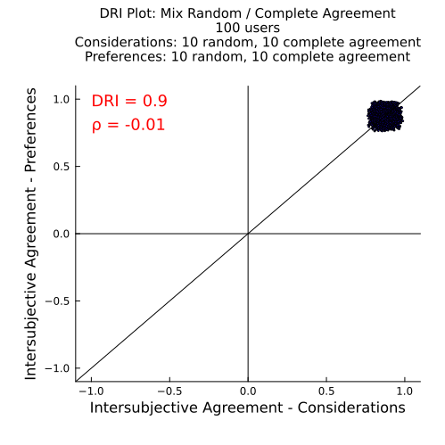
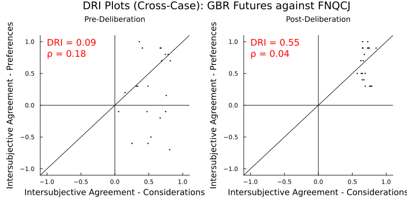

# **Technical Note: A Validity Test of the Deliberative Reason Index Using Randomized Input**
_Jonathan Warden_

---

## 1. Purpose & Scope

The **Deliberative Reason Index (DRI)**, as proposed by [Niemeyer, Veri, Dryzek, and Bächtiger (2023)](https://doi.org/10.1017/S0003055423000023), aims to quantify how closely participants’ agreement on preferences (like policies) aligns with their agreement on underlying considerations (like beliefs and values). A high DRI score (near 1) is taken to indicate high **"intersubjective consistency"** between participants, which in turn signals rational deliberation based on shared premises. This technical note shows—via three brief simulation exercises—that **high DRI values can arise even when there is no intersubjective consistency**. The goal is to provide a concise, reproducible demonstration (with [code posted here](https://github.com/social-protocols/dri-in-polis)) that invites further discussion and refinement of the index.

## 2. What DRI Measures

- **Conceptual aim:** DRI is designed to capture intersubjective consistency: the degree to which participants who similarly rank a set of “consideration” statements also similarly rank "preference" statements, and vice versa.
- **Why it matters:** Unlike measures of mere preference convergence or procedural quality, DRI focuses on the coherence between *reasons* and *conclusions*: a core ideal in deliberative democratic theory.

## 3. Brief Method: Calculating DRI

DRI is calculated as follows in Niemeyer et al. (2023) (from their [online appendix](https://www.cambridge.org/core/journals/american-political-science-review/article/how-deliberation-happens-enabling-deliberative-reason/6558F69855ADA8B15BF2EC2E5D403E71#supplementary-materials)):
1. **Survey data**: Each participant provides (a) an ordinal ranking of ~20–40 consideration statements and (b) a ranking of ≤10 policy options.
2. **Pairwise correlations**: For each pair of participants (i, j), compute Spearman’s *ρ* for their consideration-rankings (*ρ*C) and for their preference-rankings (*ρ*P).
3. **Consistency distance**: Plot (*ρ*C, *ρ*P) on an x–y scatter; measure each point’s orthogonal distance to the 45° line (y = x). Small distances indicate high intersubjective consistency for that pair.
4. **Aggregate**: Average these distances for each individual (yielding DRIInd scaled to [–1, +1]) and then across the group to obtain a single **group DRI**.

## 4. Overview of Simulations

To test whether high DRI is uniquely caused by high intersubjective consistency, we apply the same calculation to three contrived data scenarios (using Niemeyer et al. 2023's data for B & C):

- **A. Purely random data**.
- **B. Shuffled real data** (considerations and preferences randomly shuffled across participants).
- **C. Mismatched topics** (considerations on Issue X paired with preferences on Issue Y).

Under all three scenarios, DRI can reach levels exceeding 0.5, even absent any logical link between considerations and preferences. These results are fully [reproducible](https://github.com/social-protocols/dri-in-polis).

### 5 Why Random Data Can Yield High DRI

#### 5.1 Pure noise still hugs the diagonal.

Imagine 100 people each randomly ranking 10 considerations and 10 preferences.

With totally random ranking data, Spearman *ρ*'s will be normally distributed around 0. This means that when you plot Spearman *ρ*'s for considerations (x-axis) against preferences (y-axis), the cloud of points clusters around (0,0), which lies on the 45° diagonal. Thus, the distance to the diagonal is small on average and the DRI is positive, as illustrated below.

Increasing the number of considerations and preferences tightens the cluster and thereby increases the DRI.

<!--
Adding statements that everybody agrees on shifts the cluster upwards and to the right.

-->

**But, you might object:** "Real data is not random!"

---

#### 5.2: Keep the shape, break the logic.

Shuffle everybody’s preferences (each individual gets the preference-rankings of a different randomly selected individual) while leaving their consideration-rankings intact.

The marginal distribution (the “shape”) of the plot stays the same, but any genuine alignment between considerations and preferences is destroyed.

Yet in the case below (the GBR Futures case from Niemeyer et al. 2023) the DRI only falls from **0.65** to about **0.63**.

**Another possible objection:** “Okay, but the DRI is high because there is consistency in overall agreement levels.”

---

### 5.3: Franken-Case: Cross-Topic Pairings

Pair participants' consideration-rankings from one survey (the GBR Futures case) with a different set of participants' preference-rankings from another, wholly unrelated survey (the FNQCJ case).

This mismatched data still shows a substantial increase in DRI (0.09 pre-deliberation to 0.55 post-deliberation).

## 6. Summary of Experiments

| Simulation        | N users | Considerations × Preferences | DRI (example) | Note                   |
|-------------------|---------|--------------------|---------------|------------------------|
| Random (10×10)    | 100     | 10 × 10            | 0.23          | Pure noise             |
| Random (100×100)  | 100     | 100 × 100          | 0.77          | Tighter clustering     |
| Shuffled GBR Futures   | 7     | 35 × 7             | 0.63          | Permuted preferences   |
| Franken GBR+FNQCJ | 7      | 35 × 5             | 0.55          | Cross-topic pairing    |

In all of the above experiments, preferences are drawn **randomly** from some distribution -- meaning there is no possible logic linking consideration-rankings to preference-rankings.

All of these experiments result in a high DRI because the points on the plot fall in a **cluster** that is **near the diagonal**.

The cluster will be near the diagonal whenever the horizontal mean is approximately the same as the vertical mean.

This can happen spuriously with:

1. **totally random data**, because random Spearman correlations concentrate around (0,0), and
2. corresponding levels of **overall agreement** on both considerations and preferences (e.g. shuffled or cross-topic data), even when no logic ties them together.

Although high intersubjective consistency can also contribute to a high DRI, DRI cannot on its own distinguish between genuinely-high intersubjective consistency and corresponding overall agreement.

### 7. Genuine Intersubjective Consistency

However, not all high DRI values are spurious. For example, in the Fremantle Bridge case, the high DRI can't be explained by the above possibilities (the nature of Spearman correlations or corresponding overall agreement). Unlike in the shuffled GBR Futures experiment or the Franken-case, the DRI **falls** significantly (0.34 → 0.06) when the logical link between considerations and preferences is broken via shuffling. A high Pearson's *ρ* of 0.69 adds further evidence of intersubjective consistency.

## 8. Suggestions Further Research

1. **Permutation tests for statistical significance.**
    - For each of the 19 cases in Niemeyer et al. (2023), shuffle profiles 1,000–10,000 times to build a null distribution of DRI and the **DRI delta** (change from pre- to post-deliberation).
    - Compute p-values: *Is the observed increase in DRI larger than expected if there was no intersubjective consistency?*
2. **Domain-restriction simulations.**
    - Simulate groups with a known linear logic linking considerations to preferences. Vary the range of generated *ρ*C to test how DRI and Pearson's *ρ* respond. 
3. **Cross-case meta-analysis.**
    - Apply these tests across all 19 forums; examine whether design features (group-building, complexity, decision-impact) predict *statistically significant* gains in intersubjective consistency.
4. **Refining the index.**
    - Explore a “corrected DRI” subtracting expected diagonal proximity under a null.
    - Compute the Pearson correlation or regression coefficient between *ρ*C and *ρ*P across pairs; compare its sensitivity and robustness to DRI.

These tests may help discern the extent to which a high DRI truly reflects **deliberative reason**, rather than a statistical mirage, and may point the way to a refined DRI that better measures intersubjective consistency.

All code for reproducing these results is in [this repository](https://github.com/social-protocols/dri-in-polis).

### Invitation to Collaborators

We welcome co-authors interested in advancing a more robust measure of deliberative integration. Please contact me:

- https://x.com/johnwarden
- https://bsky.app/profile/jonathanwarden.bsky.social
- mail@social-protocols.org
- telegram: @jonathanrwarden
